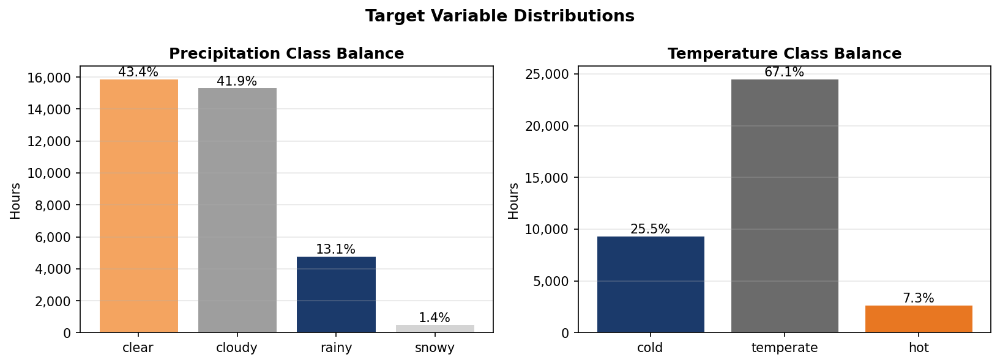
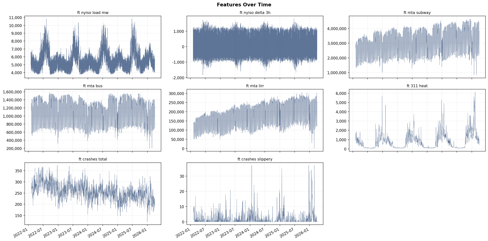
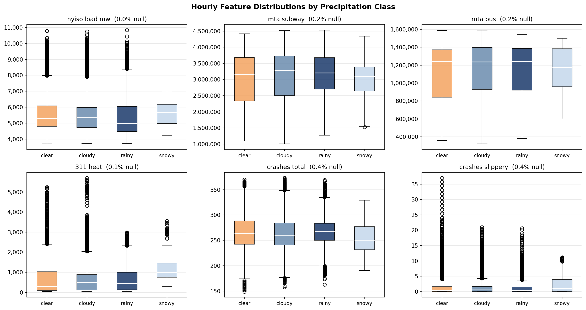
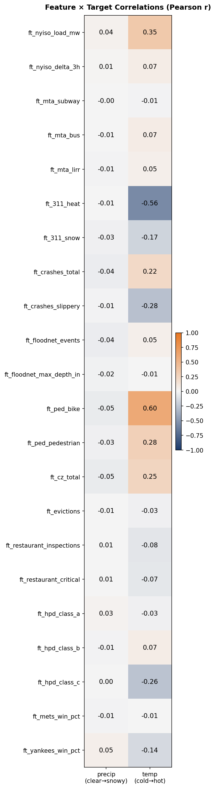
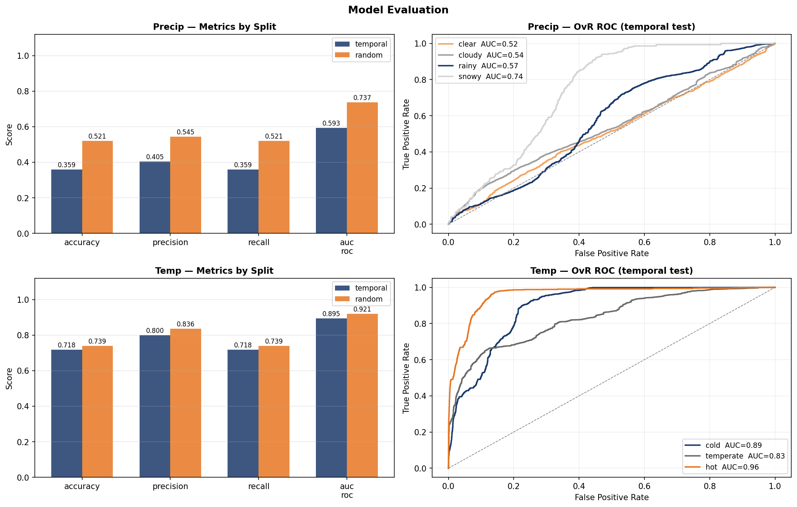
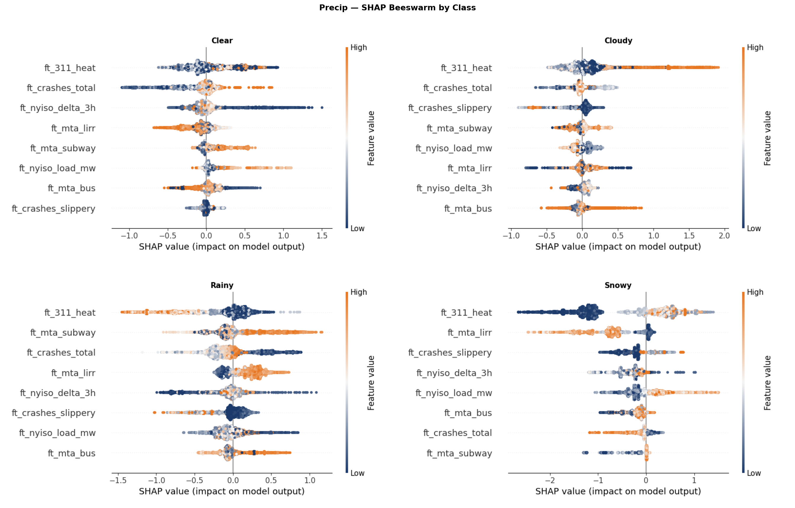
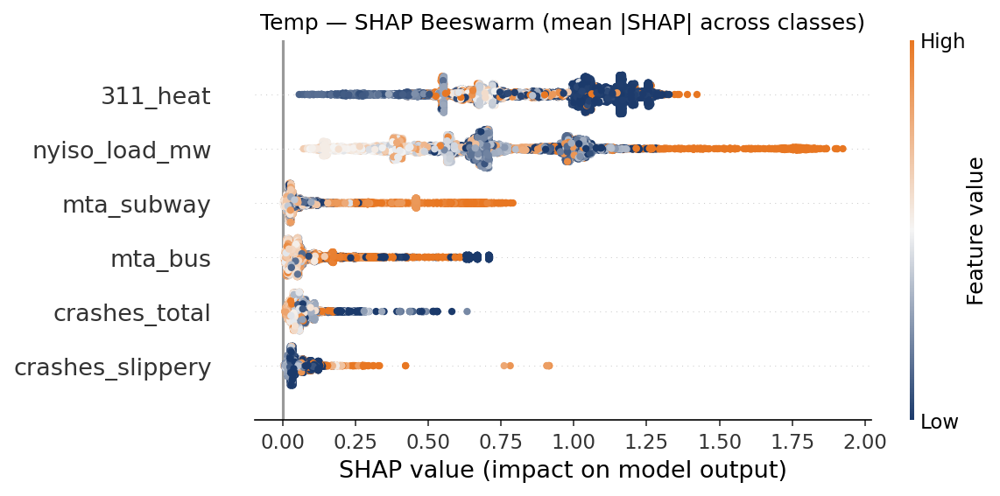

# NYC Proxy Weather Nowcaster

Predict NYC weather conditions using only indirect proxy data — no direct weather measurements as model inputs. Ground truth labels come from Open-Meteo ERA5.

**Targets:** Precipitation class `{clear, cloudy, rainy, snowy}` and temperature class `{cold, temperate, hot}`.

```
kedro run --pipeline data_engineering
kedro run --pipeline data_science
```

---

## Targets

Labels derived from ERA5 hourly reanalysis. Free, no API key, available back to 1940.

| Target | Derivation |
|---|---|
| `snowy` | snowfall > 0 cm |
| `rainy` | precipitation ≥ 1 mm (and no snow) |
| `cloudy` | cloud cover ≥ 60% (and no precip) |
| `clear` | otherwise |
| `cold` | mean temp < 4.44°C (40°F) |
| `hot` | mean temp > 26.67°C (80°F) |
| `temperate` | otherwise |



---

## Features

Daily sources are reindexed to hourly (each day's published value held constant across all 24 hours), then shifted by the publication lag. NaN only during the warmup period and genuine source gaps. NYISO is natively hourly.

| Feature | Columns | Observed lag | Source |
|---|---|---|---|
| NYISO grid load (Zone J) | `nyiso_load_mw` | ~0.2h | `mis.nyiso.com` monthly zip archives |
| MTA ridership | `mta_subway`, `mta_bus` | ~57h → 3-day param | `data.ny.gov` — `sayj-mze2` |
| NYC 311 complaints | `311_heat`, `311_flood`, `311_snow` | ~31h → 2-day param | `data.cityofnewyork.us` — `erm2-nwe9` |
| Motor vehicle crashes | `crashes_total`, `crashes_slippery` | ~105h → 5-day param | `data.cityofnewyork.us` — `h9gi-nx95` |

**Signals:**
- **NYISO load** — cold/hot weather drives heating and AC load directly; strongest hourly signal.
- **MTA ridership** — drops sharply in blizzards, moderately in heavy rain.
- **311 complaints** — `HEAT/HOT WATER` → cold; flooding → rain; snow complaints → snow.
- **Crash slippery pavement** — `contributing_factor_vehicle_1 = 'Pavement Slippery'` extracted server-side via SoQL `case()`.







---

## Results






