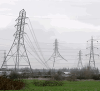
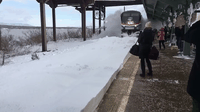

# NYC Proxy Weather Nowcaster

Why do we need historical temperature and pressure trends or complex physical models to predict the weather when we have access to the goings-on of the great people of New York City? That is what I am trying to answer with this repo. In this repo, correlation is causation. 

## Targets

Labels are derived from the Open-Meteo ERA5 archive — free, no API key, hourly resolution back to 1940. Each hourly row is assigned a precipitation class and a temperature class. Class imbalance (snowy is ~7% of hours) is handled via class-proportionality sample weighting at training time.

| Target | Derivation |
|---|---|
| `snowy` | snowfall > 0 cm |
| `rainy` | precipitation ≥ 1 mm (and no snow) |
| `cloudy` | cloud cover ≥ 60% (and no precip) |
| `clear` | otherwise |
| `cold` | mean temp < 4.44°C (40°F) |
| `hot` | mean temp > 26.67°C (80°F) |
| `temperate` | otherwise |


### Data

```
Open-Meteo ERA5      →  ground truth labels (precip class, temp class)
NYISO grid load     ─┐
MTA ridership        ├─ lag-shifted features → XGBoost → prediction + confidence
NYC 311 complaints   │
Motor vehicle crashes┘
```

The key constraint is that no direct weather data is used as a model input. Instead, proxy sources are used — things that *respond to weather* rather than measuring it. The model learns to invert that relationship.

**Publication lag:** Each source has a known delay between when an event happens and when the data is published. The lag shift `feature[t] = value[t - lag_days]` ensures the model only ever sees data that would have been available at the time of prediction.

---

## Features

<table>
<tr>
<td width="220" align="center"></td>
<td valign="top"><strong><code>ft_nyiso_load_mw</code></strong> — Real-time electricity consumption for the NYC grid zone. High load in summer (AC) and winter (heating) is a direct temperature signal.</td>
</tr>
<tr>
<td width="220" align="center"></td>
<td valign="top"><strong><code>ft_nyiso_delta_3h</code></strong> — 3-hour change in grid load. Captures intra-day momentum — a rapid swing often means a weather front moving through.</td>
</tr>
<tr>
<td width="220" align="center"></td>
<td valign="top"><strong><code>ft_mta_subway</code></strong> — Daily subway entries system-wide. Rain and cold push riders underground; heat keeps them there. One of the strongest precipitation discriminators.</td>
</tr>
<tr>
<td width="220" align="center"></td>
<td valign="top"><strong><code>ft_mta_bus</code></strong> — Daily bus boardings citywide. More weather-sensitive than subway: rain and cold spike ridership as pedestrians seek shelter.</td>
</tr>
<tr>
<td width="220" align="center"></td>
<td valign="top"><strong><code>ft_mta_lirr</code></strong> — Daily Long Island Rail Road boardings. Snow events devastate LIRR operations — cancellations and suppressed demand show up immediately.</td>
</tr>
<tr>
<td width="220" align="center"></td>
<td valign="top"><strong><code>ft_311_heat</code></strong> — NYC 311 heat/inadequate heat complaints. Spikes in winter when building heat fails during cold snaps.</td>
</tr>
<tr>
<td width="220" align="center"></td>
<td valign="top"><strong><code>ft_311_snow</code></strong> — NYC 311 snow/ice complaints. A lagged but reliable signal that snow fell recently and stuck around.</td>
</tr>
<tr>
<td width="220" align="center"></td>
<td valign="top"><strong><code>ft_crashes_total</code></strong> — Total NYPD-reported motor vehicle crashes citywide. Volume drops sharply in heavy rain and snow as fewer people drive.</td>
</tr>
<tr>
<td width="220" align="center"></td>
<td valign="top"><strong><code>ft_crashes_slippery</code></strong> — Crashes attributed to slippery pavement. A direct frozen-precipitation indicator that persists for days after a snow event.</td>
</tr>
<tr>
<td width="220" align="center"></td>
<td valign="top"><strong><code>ft_floodnet_events</code></strong> — Count of IoT flood sensor activations across NYC streets. Spikes only during heavy rain events.</td>
</tr>
<tr>
<td width="220" align="center"></td>
<td valign="top"><strong><code>ft_floodnet_max_depth_in</code></strong> — Maximum street flood depth in inches recorded by FloodNet sensors. Intensity measure for the same events counted above.</td>
</tr>
<tr>
<td width="220" align="center"></td>
<td valign="top"><strong><code>ft_ped_bike</code></strong> — DOT citywide bike sensor counts. Rain and cold suppress cycling sharply; hot days see a moderate dip too.</td>
</tr>
<tr>
<td width="220" align="center"></td>
<td valign="top"><strong><code>ft_ped_pedestrian</code></strong> — DOT pedestrian sensor counts. Heavy precipitation drives people indoors; extreme heat also suppresses foot traffic.</td>
</tr>
<tr>
<td width="220" align="center"></td>
<td valign="top"><strong><code>ft_cz_total</code></strong> — MTA Congestion Zone vehicle entries (Manhattan below 60th St, from Jan 2025). Traffic volume falls during storms.</td>
</tr>
<tr>
<td width="220" align="center"></td>
<td valign="top"><strong><code>ft_evictions</code></strong> — NYC marshal-executed evictions. Weakly seasonal — fewer evictions in winter months correlates loosely with cold weather policy patterns.</td>
</tr>
<tr>
<td width="220" align="center"></td>
<td valign="top"><strong><code>ft_restaurant_inspections</code></strong> — DOHMH restaurant inspection volume. Inspectors go out less in bad weather, creating a mild precipitation proxy.</td>
</tr>
<tr>
<td width="220" align="center"></td>
<td valign="top"><strong><code>ft_restaurant_critical</code></strong> — Critical violations found during inspections. Correlated with inspection volume but adds severity signal.</td>
</tr>
<tr>
<td width="220" align="center"></td>
<td valign="top"><strong><code>ft_mets_win_pct</code></strong> — Mets season win percentage (NaN off-season). Games are called for rain; win rate dips correlate loosely with bad-weather stretches.</td>
</tr>
<tr>
<td width="220" align="center"></td>
<td valign="top"><strong><code>ft_yankees_win_pct</code></strong> — Yankees season win percentage (NaN off-season). Same logic as Mets — a second independent baseball-weather proxy.</td>
</tr>
</table>

Daily sources are reindexed to hourly by holding each day's value constant across all 24 hours, then the lag shift is applied on the hourly index.


---

## Results

Models are evaluated against two holdout sets: a temporal test set (Jul 2024–present, production-realistic) and a random 10% sample across all time (an upper bound). The temporal test is the honest number — it measures performance on future data the model has never seen.


SHAP values explain which features drove each prediction, broken out per class. Each panel shows how features push the model toward that specific class — high NYISO load, for example, has a large positive effect on "hot" and a large negative effect on "cold", which would cancel out in a class-averaged view.


## Quick Start

### 1. Install dependencies

```bash
python -m venv .venv
source .venv/bin/activate
pip install -e .
```

### 2. Train the models

Fetches all data sources, merges them, and trains both classifiers. On first run it downloads ~4 years of hourly data — expect 3–5 minutes.

```bash
kedro run
```

Outputs written to `data/03_primary/`: trained models, evaluation plots, SHAP plots.

### 3. Run inference

Loads the trained models and generates a prediction for the most recent available hour.

```bash
kedro run --pipeline inference
```

Output: `data/03_primary/predictions.json`

### 4. Launch the website

```bash
streamlit run app/app.py
```

Opens at `http://localhost:8501`. Shows the current precipitation and temperature prediction with confidence level and SHAP feature contributions.

To run the site persistently in the background (survives closing the terminal):

```bash
nohup streamlit run app/app.py >> logs/streamlit.log 2>&1 &
```

To stop it:

```bash
pkill -f "streamlit run"
```

### 5. Schedule hourly refresh

The shell script re-fetches today's data and runs inference:

```bash
bash run_inference_only.sh   # fast: data_engineering + inference only
bash run_pipeline.sh         # full: data_engineering + retrain + inference
```

To run automatically, add to cron (`crontab -e`):

```
# Hourly fast refresh (data + inference)
5 * * * * docker exec weather-pipeline /app/run_inference_only.sh >> /home/zaccosenza/code/project-weather-dumb/logs/cron.log 2>&1

# Nightly full retrain at 02:00
0 2 * * * docker exec weather-pipeline /app/run_pipeline.sh >> /home/zaccosenza/code/project-weather-dumb/logs/cron.log 2>&1
```

For Docker-based production setup, see [PRODUCTION.md](PRODUCTION.md).

---